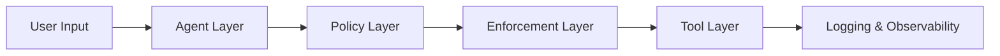
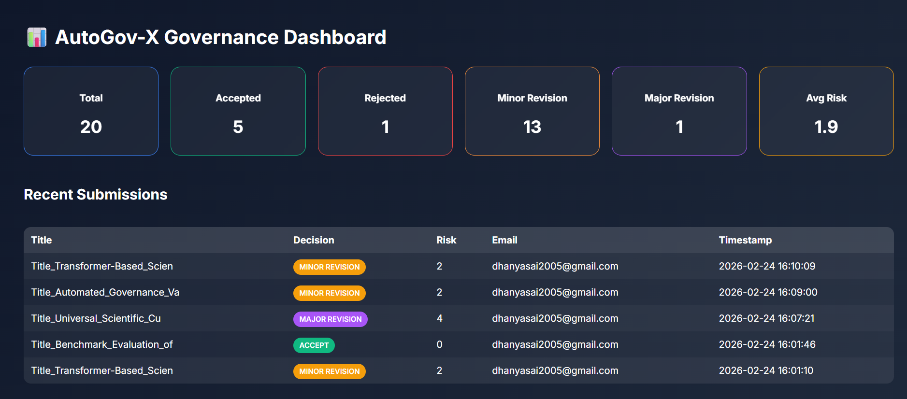

# 🔐 PolicyGuard AI
### Intent-Aware Autonomous Governance Engine

  <b>⚖️ Enforce • 🛡️ Secure • 🤖 Govern AI Systems</b>  
  <i>Built by Team HackSqad | Chandigarh University</i>

---

## 📌 Overview
PolicyGuard AI is an **intent-aware governance engine** designed to regulate autonomous AI systems that perform real-world actions such as file operations, database updates, and API calls.

It ensures every AI action is:
- ✅ Safe  
- ⚖️ Policy-compliant  
- 🛡️ Secure  
- 📊 Fully traceable  

---

## ❗ Problem
Autonomous AI systems can:
- Perform unauthorized actions  
- Modify critical data  
- Access restricted directories  
- Execute malicious instructions  

Traditional rule-based systems lack contextual intelligence, making them insufficient for AI governance.

---

## 💡 Solution
PolicyGuard AI introduces a **multi-layer governance architecture**:
User → AI Agent → Policy Engine → Runtime Guard → System Resources

✔ Intent analysis  
✔ Risk scoring  
✔ Execution planning  
✔ Runtime enforcement  
✔ Logging & auditing  

---

## 🏗️ Architecture

⚙️ How It Works
AI input is analyzed
Risk score is computed
Execution plan is generated
Runtime guard validates safety
Action is executed or blocked
Logs and notifications are generated

🔐 Governance Rules
✅ Allowed
Writing to approved directories
Storing metadata in database
Sending notifications after approval

❌ Disallowed
System directory access (e.g., System32)
Unauthorized API calls
Overwriting protected files
Executing OS commands

⚠️ Conditional
Execution allowed only if risk ≤ threshold
Requires policy approval

🛡️ Enforcement
Pre-Execution: Risk validation, policy checks
Runtime: Directory & action validation
Policy-as-Code: Hard constraints (no override)
Logging: Full audit trail

📊 Risk Model
Score	Decision
0	Accept
≤ 3	Minor Revision
≤ 7	Major Revision
> 7	Reject

🔄 Outcomes
✅ Accept → /accepted
✏️ Minor → /minor
⚠️ Major → /major
❌ Reject → /rejected
🚫 Malicious → Blocked

📈 Dashboard
Total submissions
Risk distribution
Average risk score
Activity logs

## 🖼️ Screenshots

### Dashboard

### Risk Analysis

### Execution Flow

🧪 Use Cases
AI governance systems
Secure AI pipelines
Enterprise AI compliance
Research validation

🛠️ Tech Stack
Backend: Python
Database: SQLite
AI: LLM integration
Frontend: Dashboard UI
Services: Email notifications

## 👩‍💻 Author
Manya Sondhi
